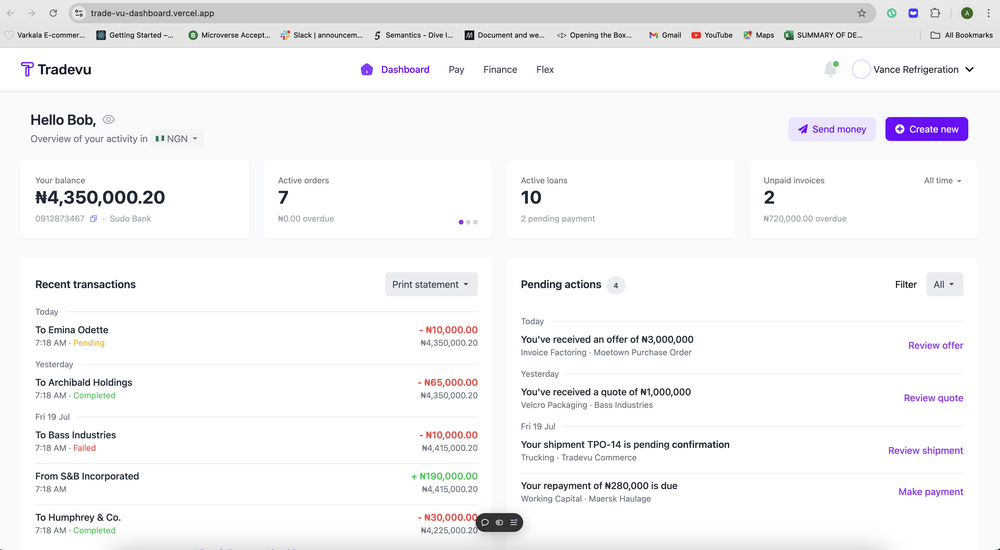

<div align="center">
  <h3><b>TradeVuDashboard</b></h3>
</div>


<div align="center">
  <!-- You are encouraged to replace this logo with your own! Otherwise you can also remove it. -->
  
  <br/>

</div>
<!-- TABLE OF CONTENTS -->

# 📗 Table of Contents

- [📖 About the Project](#about-project)
  - [🛠 Built With](#built-with)
    - [Tech Stack](#tech-stack)
    - [Key Features](#key-features)
  - [🚀 Live Demo](#live-demo)
- [💻 Getting Started](#getting-started)
  - [Prerequisites](#prerequisites)
  - [Setup](#setup)
  - [Install](#install)
  - [Usage](#usage)
  - [Run tests](#run-tests)
  - [Deployment](#deployment)
- [👥 Authors](#authors)
- [🔭 Future Features](#future-features)
- [🤝 Contributing](#contributing)


<!-- PROJECT DESCRIPTION -->

# 📖 TradeVuDashboard <a name="about-project"></a>


**Tradevu TradeVuDashboard** is a dashboard-based application that enables users to manage transactions, notifications, and other financial activities. It uses modern web development tools to provide a clean and responsive user interface.

## 🛠 Built With <a name="built-with"></a>

### Tech Stack <a name="tech-stack"></a>

<details>
  <summary>Client</summary>
  <ul>
    <li><a href="https://reactjs.org/">React.js</a></li>
    <li><a href="https://tailwindcss.com/">Tailwind CSS</a></li>
    <li><a href="https://react-icons.github.io/react-icons/">React Icons</a></li>
    <li><a href="https://www.npmjs.com/package/react-toggle">React Toggle</a></li>
  </ul>
</details>

<details>
  <summary>Server</summary>
  <ul>
    <li>No backend for this project, purely frontend.</li>
  </ul>
</details>

<details>
<summary>Database</summary>
  <ul>
    <li>No database integration for this project.</li>
  </ul>
</details>

<!-- Features -->

### Key Features <a name="key-features"></a>

- **Dashboard Overview**: Display user balances, active orders, loans, and recent transactions.
- **Create New Dropdown**: Allows users to create invoices, orders, and shipments.
- **Notification System**: Provides a popup with notifications and filtering options.
- **Responsive Design**: Optimized for both desktop and mobile views.
- **Copy to clipboard**: when you click the copy icon, the account number is copied to the clipboard.
- **Hide and show balance: when you click the eye icon, the account balance is exposed and vice versa**.

<p align="right">(<a href="#readme-top">back to top</a>)</p>

<!-- LIVE DEMO -->

## 🚀 Live Demo <a name="live-demo"></a>

- [Live Demo Link](https://trade-vu-dashboard-git-dev-abraham-ibizugbes-projects.vercel.app/)

<p align="right">(<a href="#readme-top">back to top</a>)</p>

<!-- GETTING STARTED -->

## 💻 Getting Started <a name="getting-started"></a>

To get a local copy of this project up and running, follow these steps.

### Prerequisites

Ensure you have the following installed on your local machine:

- **Node.js** (v14 or higher)
- **npm** (v6 or higher)

### Setup

Clone this repository to your desired folder:

```sh
  git clone git@github.com:yourusername/tradevu-takehome.git
  cd TradeVuDashboard
```

### Install

Install this project with:

```sh
  cd m
  npm install TradeVuDashboard
```

### Usage

To run the project, execute the following command:

```sh
  npm run dev
```


### Deployment
- This project has been deployed with vercel.
<!--
Example:

```sh

```
 -->

<p align="right">(<a href="#readme-top">back to top</a>)</p>

<!-- AUTHORS -->

## 👥 Authors <a name="authors"></a>


👤 **Abraham Ibizugbe**

- GitHub: [@ibizugbe](https://github.com/ibizugbe)
- LinkedIn: [Abraham Ibizugbe](https://www.linkedin.com/in/abrahamibizugbe/)


<p align="right">(<a href="#readme-top">back to top</a>)</p>

<!-- FUTURE FEATURES -->

## 🔭 Future Features <a name="future-features"></a>

- [ ] **User Authentication: Add login and signup functionality.**
- [ ] **Data Integration: Integrate with a backend for dynamic data handling.**
- [ ] **Notification Sound Alerts: Play a sound when new notifications arrive.**

<p align="right">(<a href="#readme-top">back to top</a>)</p>

<!-- CONTRIBUTING -->

## 🤝 Contributing <a name="contributing"></a>

Contributions, issues, and feature requests are welcome!

Feel free to check the [issues page](../../issues/).

<p align="right">(<a href="#readme-top">back to top</a>)</p>
